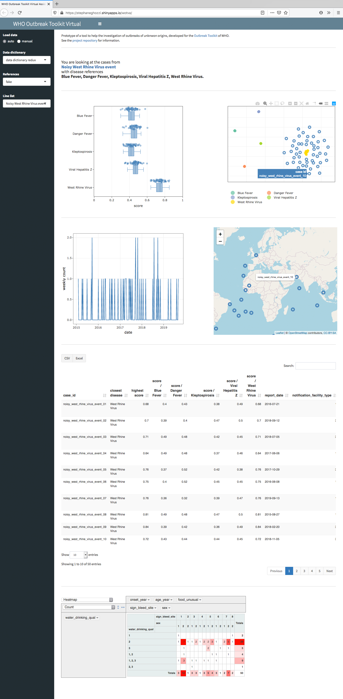

<!-- omit in toc -->
# WHO Outbreak Toolkit Virtual Assistant

- [Overview](#overview)
- [Data](#data)
  - [Automatic loading](#automatic-loading)
  - [Manual upload](#manual-upload)
- [Issues and TODOs](#issues-and-todos)
- [Session information](#session-information)
- [Contributions](#contributions)
- [Licence](#licence)

## Overview

The WHO Outbreak Toolkit Virtual Assistant is a prototypical tool to help the investigation of outbreaks of unknown origin, developed for the [Outbreak Toolkit](https://www.who.int/emergencies/outbreak-toolkit) of the [World Heath Organization](https://www.who.int).

Case data are analyzed and visualized in an interactive dashboard. The goal is to help formulate hypotheses on the diseases that might cause an outbreak, either identify likely candidates or exclude unlikely ones. The tool aims also at priorizing which diseases should be considered first.

A live version of the dashboard is accessible at https://stephaneghozzi.shinyapps.io/wotva

*Screenshot of the WHO Outbreak Toolkit Virtual Assistant*

The core idea is to compare individual cases to *disease references* and to one another. The references are what a typical case might look like, with variability taken into account, e.g. "patients of that disease are rather male, between 1 and 4 years old, and live in tropical regions".

Input:
1. **data dictionary:** what the line list contains: list of variables, their format and type, the values they can take, whether they can take multiple values ;
2. **references:** for each disease of interest: for the variables in the data dictionary, the typical values it can take (as range or set), a weight measuring their importance in identifying the disease, as well as optionally their typical extension (e.g. cases are typically close to one another in time or space);
3. **case data:** a filled line list for each event.

Output:
1. **two dimensional visualisation** of cases and references (dimensionality reduction: distances between all cases, suspected or reference, are computed in high dimension and visualized in two dimensions);
2. **scores** measure the similarity between cases and references;
3. various interactive widgets (epicurve, map, line list, pivot table) to illustrate how the tool could be integrated in a broader outbreak investigation or management tool.

Templates for reference and line list are provided in [data/references](doc/references) and [data/linelists](doc/linelists) respectively.

The approach, results and perspectives are presented in [doc/outbreak_toolkit-assistant-presentation-20191016-long.pdf](doc/outbreak_toolkit-assistant-presentation-20191016-long.pdf) and [doc/report-nopreprocessing.pdf](doc/report-nopreprocessing.pdf) (with a slightly outdated version of the dashboard).

The different processing steps and functions are presented in [vignette/vignette.html](vignette/vignette.html). The sources for the functions are found in [src/](src/).

## Data

The data consist of the inputs described above. They can be loaded either automatically or manually as specified by the radio button "Load data".

### Automatic loading

For each input, a drop down menu lists the datasets available in the application. These are CSV files stored respectively in [data/datadictionary](data/datadictionary), [data/references](data/references) and [data/linelists](data/linelists).

Here we provide one data dictionary, two sets of references, and for each five line lists corresponding to different types of events. 

A *set of references* are all CSV files in a directory under data/references: here fake/ and real/. The fake references have been filled randomly for five imaginary diseases; they are complete, i.e. all variables have values. The real references correspond to five existing diseases (that have a jaundice symptom in common); they are sometimes quite similar one to the other and are sparsely filled.

Then case data, i.e. a filled *line list*, can then be chosen. Since the purpose of the dashboard is to illustrate the approach, we provide random line lists that correspond to five different types of events for each set of references: random, exactly one disease, one disease with noise added, exactly two diseases, and two diseases with noise added. The available line lists are all CSV files in directories under data/linelists, where the directory names have to be of the form "[reference set]_ref", i.e. line lists are organized along reference sets: here "fake_ref" and "real_ref".

The names of data dictionary, references and line lists are the file names with ".csv" removed and "_" replaced with a whitespace " ".

### Manual upload

Data dictionary, references and line list can be also be uploaded manually. One should be careful that all are in a compatible format, i.e. all follow the data dictionary uploaded. They have to be CSV files.

The references have to be in the same directory, any number of them can be selected.

To test the upload function one can of course use the files provided here in [data/datadictionary](data/datadictionary), [data/references](data/references) and [data/linelists](data/linelists).

Here as well, the names of data dictionary, references and line lists are the file names with ".cvs" removed and "_" replaced with a whitespace " ".

## Issues and TODOs

- Cache the results (scores and dimensionality reduction).
- Reset references when a new data dictionary is selected, reset case data (line list) when new references are selected.
- Improve the computation speed of distances.

## Session information

The dashboard deployed on https://stephaneghozzi.shinyapps.io/wotva was built with:

```
R version 3.6.1 (2019-07-05)
Platform: x86_64-apple-darwin15.6.0 (64-bit)
Running under: OS X El Capitan 10.11.6

Matrix products: default
BLAS:   /System/Library/Frameworks/Accelerate.framework/Versions/A/Frameworks/vecLib.framework/Versions/A/libBLAS.dylib
LAPACK: /Library/Frameworks/R.framework/Versions/3.6/Resources/lib/libRlapack.dylib

locale:
[1] en_US.UTF-8/en_US.UTF-8/en_US.UTF-8/C/en_US.UTF-8/en_US.UTF-8

attached base packages:
[1] stats     graphics  grDevices utils     datasets  methods  
[7] base     

other attached packages:
 [1] dplyr_0.8.3           Rtsne_0.15           
 [3] DT_0.9                rpivotTable_0.3.0    
 [5] leaflet_2.0.2         plotly_4.9.0         
 [7] ggplot2_3.2.1         ISOweek_0.6-2        
 [9] shinycssloaders_0.2.0 shinydashboard_0.7.1 
[11] shiny_1.4.0          

loaded via a namespace (and not attached):
 [1] tidyselect_0.2.5   purrr_0.3.2        colorspace_1.4-1  
 [4] vctrs_0.2.0        htmltools_0.4.0    viridisLite_0.3.0 
 [7] yaml_2.2.0         rlang_0.4.0        later_1.0.0       
[10] pillar_1.4.2       glue_1.3.1         withr_2.1.2       
[13] RColorBrewer_1.1-2 lifecycle_0.1.0    stringr_1.4.0     
[16] munsell_0.5.0      gtable_0.3.0       htmlwidgets_1.5.1 
[19] labeling_0.3       fastmap_1.0.1      httpuv_1.5.2      
[22] crosstalk_1.0.0    Rcpp_1.0.2         xtable_1.8-4      
[25] promises_1.1.0     scales_1.0.0       backports_1.1.4   
[28] jsonlite_1.6       mime_0.7           digest_0.6.21     
[31] stringi_1.4.3      grid_3.6.1         tools_3.6.1       
[34] magrittr_1.5       lazyeval_0.2.2     tibble_2.1.3      
[37] crayon_1.3.4       tidyr_1.0.0        pkgconfig_2.0.3   
[40] zeallot_0.1.0      data.table_1.12.2  assertthat_0.2.1  
[43] httr_1.4.1         rstudioapi_0.9.0   R6_2.4.0          
[46] compiler_3.6.1    
```

## Contributions

Conception, development and test: Stéphane Ghozzi

Conception, data dictionary, references: Lucas Deroo, Anne Perrocheau, Karl Schenkel

Funding: [INIG](https://www.rki.de/EN/Content/Institute/DepartmentsUnits/ZIG/INIG/INIG_node.html) of the [Robert Koch Institute](https://www.rki.de) and MDC of WHO.

## Licence

The code is made available under a [CC0](https://creativecommons.org/share-your-work/public-domain/cc0/) licence, i.e. others may freely build upon, enhance and reuse the works for any purposes without restriction under copyright or database law.